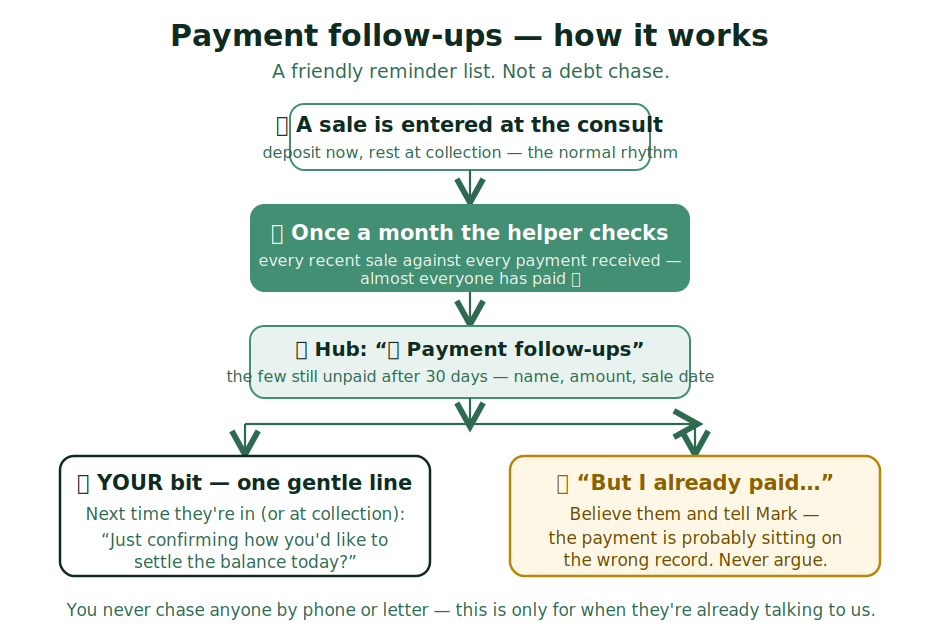

# Payment follow-ups — one gentle line, never a chase

Sales are entered at the consult; payment often comes later (deposit now, rest at
collection). Almost always that sorts itself out. **Once a month a helper checks
every sale against every payment** and lists the few that slipped through.

## The short version

- The Hub tile **💰 Payment follow-ups** shows the short list: name, amount,
  sale date. It refreshes monthly — no need to check it daily.
- **Nobody gets phoned or chased.** The list is only for when the patient is
  already talking to us — at their next visit or when they collect.
- The line to use: *"Just confirming how you'd like to settle the balance today?"*
  That's it.

> IF they say **"I already paid"**: believe them, don't argue, and **tell Mark** —
> the payment is probably sitting on the wrong record, and that's useful to know.

> IF the tile says **"Nothing to follow up"**: perfect — every recent sale is
> paid or simply not due yet.

## What you do NOT need to worry about

- You don't work out who owes what — the helper checks the sums.
- You don't chase anyone. One friendly mention when they're in, that's all.
- Old balances from years past are Mark's project, not yours.
