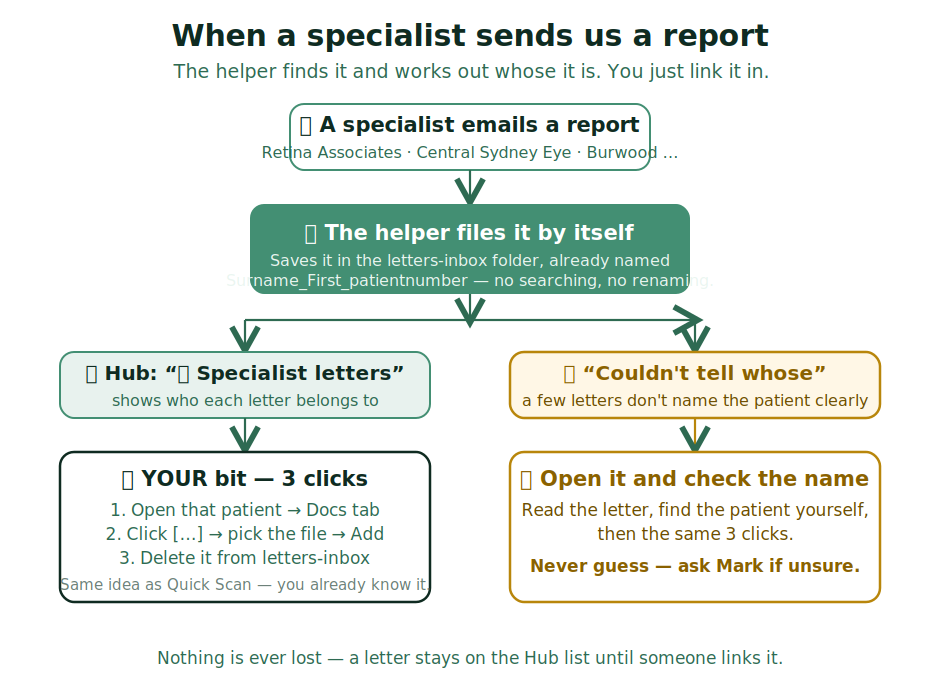

# Specialist letters — filing them in 3 clicks

Ophthalmologists email reports about our patients to info@. **A helper now finds
each one, works out whose it is, and names the file for you.** Your only job is
the final link into the patient's file — Optomate needs a person for that step.

## The short version

- The Hub tile **📄 Specialist letters** lists what's waiting. Glance at it when
  you check the invoices tile — once a day is plenty.
- Every file is in the **letters-inbox** folder, already named
  `Surname_First_patientnumber` — so you know exactly whose it is.
- Link it in: **open that patient → Docs tab → click […] → pick the file → Add.**
  Then delete it from letters-inbox. Done.

> IF the tile says **"Couldn't tell whose these are"**: open the file, read the
> patient name yourself, then do the same 3 clicks. **Never guess** — two patients
> can share a name. Ask Mark if unsure.

> IF the list is empty: nothing to do. The helper checked and found no new letters.

## What you do NOT need to worry about

- You don't watch the inbox for specialist letters any more — the helper does.
- You don't download, rename, or figure out who a letter belongs to.
- Nothing is ever lost: a letter stays on the Hub list until someone links it.
