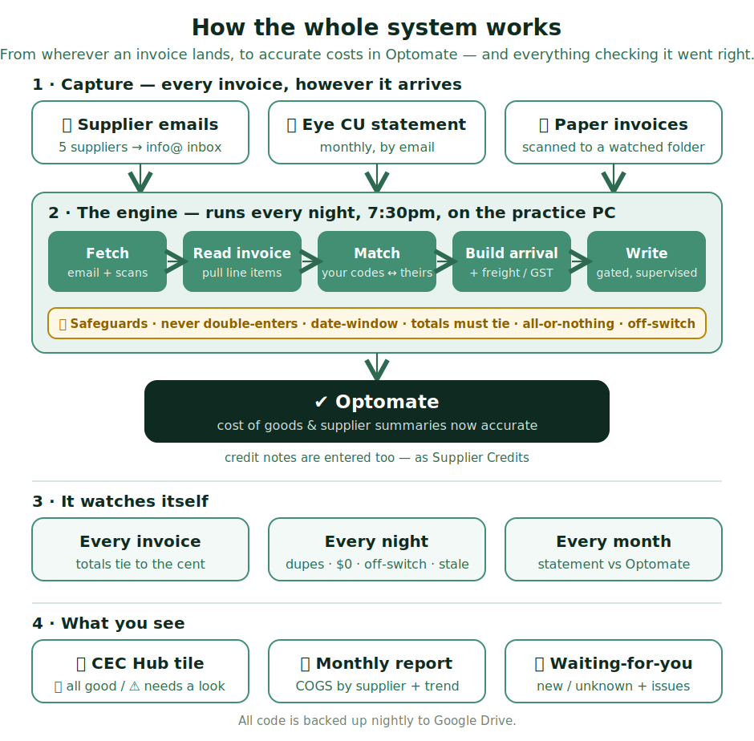

# Supplier invoices — how they get into Optomate

Suppliers send us an invoice for every order. These used to be typed into
Optomate by hand — and often it didn't get done, which made our costs look
wrong. **A helper now does this automatically.** This guide is just so you know
what's going on and, on the rare day it needs a person, what to do.

**Most days there is nothing for you to do.**

## The short version

- **Invoices that arrive by email** (Hoya, CooperVision, Menicon, Eye CU, Alcon,
  Bolle, Little 4 Eyes, Aviva) — the helper reads them and enters them into
  Optomate overnight. You don't touch them.
- **Frame invoices** (Safilo, De Rigo, Marchon, Maui Jim, VMD) — these come in
  through **ProAccounts** and need a quick **click** to enter. The Hub tells you
  which are waiting (see "Frame invoices" below). This is the one job that's yours.
- **Invoices that arrive on paper** — **scan them** so the helper can pick them up.
- Once a day, **glance at the "Supplier Invoices" tile** on the Hub. It tells you
  in plain words whether everything's fine.

## Frame invoices — the one thing that needs a click

Frame suppliers (Safilo, Maui Jim, etc.) send their invoices through **ProAccounts**.
Those don't enter themselves — someone has to **click each one** in ProAccounts to
turn it into an arrival. If nobody clicks, the frames never get counted, and our
stock and costs go wrong. So:

1. The Hub tile shows **"🕶 Frame eInvoices to click"** with a short list when some
   are waiting. That's your cue.
2. In Optomate, open the **ProAccounts eInvoice list** and click each one in to
   create the arrival. (Frames = *Invoice*; consignment stock = *Consignment Invoice*.)
3. **If it says "item missing from eCat"** — tap **"Report missing items to ProVision"**
   in that pop-up. That tells the supplier to add it; next time it will import.

> **Don't** download the whole eCatalogue to fix a missing item — it can flood the
> frame list with things we don't stock. Just *report the missing item* instead.

## Scanning a paper invoice

1. Put the invoice pages in the top feeder of the printer.
2. Tap the **"Invoices"** button on the printer screen.
3. That's it — it's on its way. You don't need to do anything in Optomate.

> If the scan looks faint or streaky, give the scanner glass a quick wipe and scan it again.

## Checking the "Supplier Invoices" tile

Open the **CEC Hub** and tap the **🧾 Supplier Invoices** tile. You'll see one of these:

> **"✅ All working"** — you're done. Nothing to do.

> **"🕶 Frame eInvoices to click"** — *this one is yours.* Click those invoices in through ProAccounts (see "Frame invoices" above).

> **"📥 To sort"** — an invoice arrived from a supplier we don't handle yet. Tell Mark.

> **Anything else that says "⚠️ Needs a look"** — **tell Mark.** Nothing is lost; it just needs Mark to sort a detail. Never urgent, never your job to fix.

## What you do NOT need to worry about

- You don't **type** invoices into Optomate by hand any more. The only frame job
  is a **click** in ProAccounts (above) — you're never keying figures.
- You don't need to check totals — the helper checks its own sums.
- If the tile ever says "hasn't run" or shows an error, that's for Mark, not you.

> The golden rule: if in doubt, **don't type anything into Optomate — just tell Mark.** Nothing bad happens by waiting.

---

## The full picture (optional — for the curious)

You don't need any of this for the day-to-day. It's just the whole system on one
page: how an invoice gets from wherever it lands all the way to accurate costs in
Optomate, and everything that quietly checks it went right.

