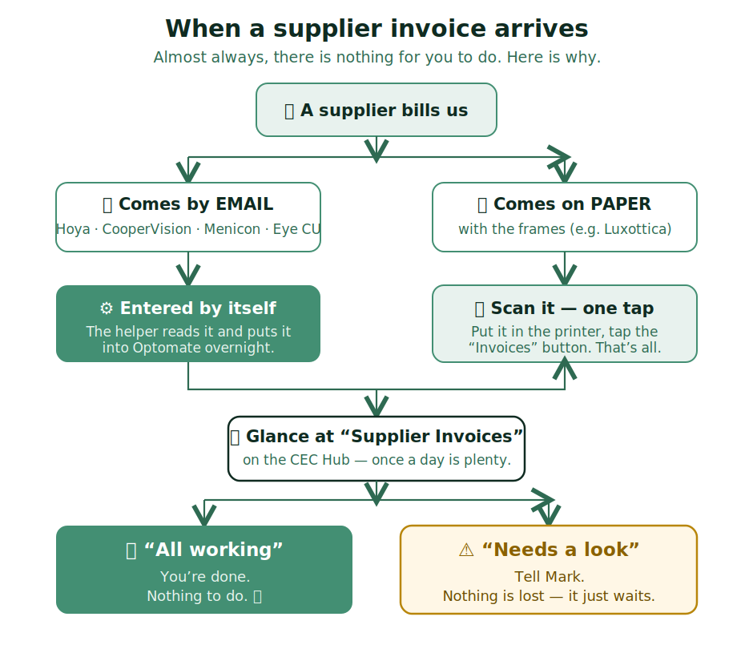

# Supplier invoices — how they get into Optomate

Suppliers send us an invoice for every order. These used to be typed into
Optomate by hand — and often it didn't get done, which made our costs look
wrong. **A helper now does this automatically.** This guide is just so you know
what's going on and, on the rare day it needs a person, what to do.

**Most days there is nothing for you to do.**

## The short version

- **Invoices that arrive by email** (Hoya, CooperVision, Menicon, Eye CU) — the
  helper reads them and enters them into Optomate overnight. You don't touch them.
- **Invoices that arrive on paper** (with the frames — e.g. Luxottica) — **scan
  them** so the helper can pick them up (see below).
- Once a day, **glance at the "Supplier Invoices" tile** on the Hub. It tells you
  in plain words whether everything's fine.

## Scanning a paper invoice

1. Put the invoice pages in the top feeder of the printer.
2. Tap the **"Invoices"** button on the printer screen.
3. That's it — it's on its way. You don't need to do anything in Optomate.

> If the scan looks faint or streaky, give the scanner glass a quick wipe and scan it again.

## Checking the "Supplier Invoices" tile

Open the **CEC Hub** and tap the **🧾 Supplier Invoices** tile. You'll see one of two things:

> IF it says "✅ All working": you're done. Nothing to do.

> IF it says "⚠️ Needs a look": **tell Mark.** Nothing is lost — an invoice or two just needs Mark to sort a detail. It is never urgent and never your job to fix.

## What you do NOT need to worry about

- You don't enter invoices into Optomate by hand any more (for the suppliers above).
- You don't need to check totals — the helper checks its own sums.
- If the tile ever says "hasn't run" or shows an error, that's for Mark, not you.

> The golden rule: if in doubt, **don't type anything into Optomate — just tell Mark.** Nothing bad happens by waiting.
