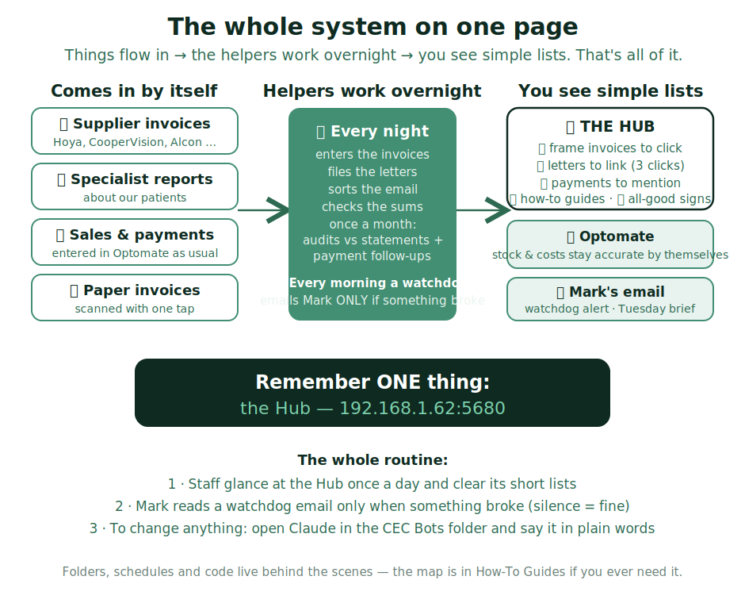

# The whole system on one page

Lots of helpers run behind the scenes here. **You don't need to remember any of
them.** You need exactly one thing: this Hub. Everything the helpers want from a
person shows up as a short list on a tile.

## The three habits (that's genuinely all)

- **Staff:** glance at the Hub once a day. Clear the short lists — click frame
  invoices in, link letters, mention balances. Green means nothing to do.
- **Mark:** do nothing unless the 🐕 watchdog emails you. Silence means every
  helper ran and checked its own sums.
- **Changing anything:** open Claude in the *CEC Bots* folder and say it in
  plain words. Never edit the machinery by hand.

> IF a tile shows ⚠️ or "needs a look": it will say in plain words whose job it
> is. When in doubt — tell Mark. Nothing is ever lost by waiting.

## For the rare day you need the detail

- **Where files live:** the engine is `C:\CEC\CEC-Optomate-Agent` (its readable
  reports are in `local-reports`, its guide is `WHATS-BUILT.md`). The Hub's code
  is in `Claude\cec-hub`. Mark's working folder is Desktop → `CEC Bots`. A backup
  of the engine syncs to Google Drive. **Never move these folders** — the
  schedules point at them.
- **Working folders:** `C:\CEC\letters-inbox` (letters awaiting their 3-click
  link) · `C:\CEC\scan-inbox` (paper invoice scans land here).
- **The schedule:** email sorting every 30 min · invoice lanes + letters +
  self-check nightly 7:30 pm · watchdog 9 am · staff reminder emails Tue + Fri ·
  statement audits + payment follow-ups monthly on the 8th.
- **If the Hub itself won't load:** wait a minute (a watchdog revives it), or
  double-click START.bat on the practice server. Still stuck? Ask Mark.
